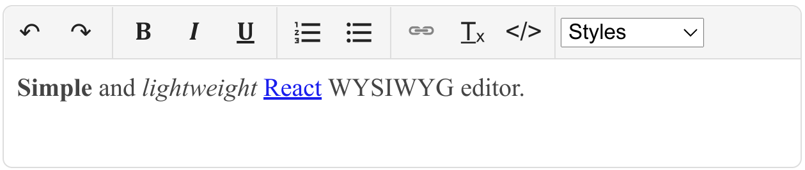

# react-simple-wysiwyg
[](https://github.com/megahertz/react-simple-wysiwyg/actions/workflows/tests.yml)
[](https://badge.fury.io/js/react-simple-wysiwyg)
[](https://bundlephobia.com/result?p=react-simple-wysiwyg)

Simple and lightweight React WYSIWYG editor. [Demo](https://megahertz.github.io/react-simple-wysiwyg/).

## Description

[](https://megahertz.github.io/react-simple-wysiwyg/)

Key features:

- pretty small (~9kb, ~4kb gzipped)
- fast
- simple to configure
- simple to extend
- support automatic LTR and RTL text direction switching for Arabic languages

Of course, it's not so powerful as other complex editors. It DOES NOT:

- ✗ change HTML generated by a browser (sometimes it can be dirty)
- ✗ sanitize HTML (you can use [sanitize-html](https://www.npmjs.com/package/sanitize-html))
- ✗ contain advanced features as others (like table editor, image editor and so on)
- ✗ support old browsers (IE 11 is minimal)

If you need a more powerful solution for React, you'd better take a look at more 
powerful editors like Slate.js, Tiptap, CKEditor, TinyMCE, Quill or Summernote 
and so on.

## Usage

 1. Install with [npm](https://npmjs.org/package/react-simple-wysiwyg):

    `npm install react-simple-wysiwyg`
    
    or [CDN (unpkg.com)](https://unpkg.com/react-simple-wysiwyg/)
   
    `<script src="//unpkg.com/react-simple-wysiwyg"></script>`
    
 2. Use the component
 
    ```jsx
    import { useState } from 'react';
    import Editor from 'react-simple-wysiwyg';
    
    function App() {
      const [html, setHtml] = useState('my <b>HTML</b>');
      
      function onChange(e) {
        setHtml(e.target.value);
      }
    
      return (
        <Editor value={html} onChange={onChange} />
      );
    }
    ```
    
### Component Props

Generally, all props as well as a ref are passed to the content editable 
element, which is a div element. It also supports a few additional properties 
to act like an input element:

- **autoFocus**
- **disabled** for read-only mode
- **name** for onChange event
- **placeholder**
- **tagName** 'div' by default
- **value**

You can also set the root container props using `containerProps` property.

### Custom toolbar

```tsx
import { useState } from 'react';
import Editor, { 
  BtnBold,
  BtnItalic,
  Toolbar
} from 'react-simple-wysiwyg';

export default function CustomEditor() {
  const [value, setValue] = useState('simple text');

  function onChange(e) {
    setValue(e.target.value);
  }

  return (
    <Editor value={value} onChange={onChange}>
      <Toolbar>
        <BtnBold />
        <BtnItalic />
      </Toolbar>
    </Editor>
  );
}
```

Check [DefaultEditor.tsx](src/editor/DefaultEditor.tsx) for details.

### Custom buttons

This library contains only a basic set of buttons, but it can be extended
easily. Check [buttons.ts](src/toolbar/buttons.tsx) and 
[dropdowns.ts](src/toolbar/dropdowns.tsx) for example. Most of the buttons use
[document.execCommand](https://developer.mozilla.org/en-US/docs/Web/API/Document/execCommand).
You can find a list of all available commands there. This API is deprecated,
but there is still no alternative and there are no plans to remove it from
browsers. Most of the popular WYSIWYG editors continue using it.

```tsx
import Editor, { 
  BtnBold, 
  BtnItalic, 
  createButton,
  EditorProvider, 
  Toolbar
} from 'react-simple-wysiwyg';

const BtnAlignCenter = createButton('Align center', '≡', 'justifyCenter');

export default function CustomEditor({ value, onChange }) {
  return (
    <Editor value={value} onChange={onChange}>
      <Toolbar>
        <BtnBold />
        <BtnItalic />
        <BtnAlignCenter />
      </Toolbar>
    </Editor>
  );
}
```

### Editor style and size

By default, it fills the whole width of the parent element, and the height
depends on a content height. It could be customized easily. The root element
of the editor has `rsw-editor` css class, so you could use it in your styles.

Also, you can pass `containerProps` to customize editor appearance. Here's an
example how make the editor resizable:

```tsx
<Editor 
  containerProps={{ style: { resize: 'vertical' } }}
  value={html}
  onChange={onChange}
/>
```

All css classes are consistent, so feel free to use these names in your css:

- `rsw-editor` (root container)
- `rsw-ce` (editable area)
- `rsw-toolbar`
  - `rsw-btn`
  - `rsw-separator`
  - `rsw-dd` (drop down list)
  
## Troubleshooting

### Style issues: no list item bullets, wrong link styles and so on

[#31](https://github.com/megahertz/react-simple-wysiwyg/issues/31),
[#44](https://github.com/megahertz/react-simple-wysiwyg/issues/44),
[#45](https://github.com/megahertz/react-simple-wysiwyg/issues/45)

RSW editor doesn't isolate its styles from the parent styles. 
It's a pretty common case when you use a global reset or normalize styles which
remove bullets or numbers for lists. 
To fix that, you should redefine these styles again:

```css
.rsw-ce ul {
  list-style: disc;
  padding-left: 2em;
}

.rsw-ce ol {
  list-style: decimal;
  padding-left: 2em;
}
```

### Insert a link which target="_blank"

[#55](https://github.com/megahertz/react-simple-wysiwyg/issues/55). Also, it's a
good example of inserting a custom HTML element.

## Credits

 - Based on 
   [lovasoa/react-contenteditable](https://github.com/lovasoa/react-contenteditable)
 - Uses [Material Design Icons](http://materialdesignicons.com/)
