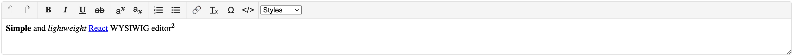

# react-simple-wysiwyg
[](https://travis-ci.org/megahertz/react-simple-wysiwyg)
[](https://badge.fury.io/js/react-simple-wysiwyg)
[](https://bundlephobia.com/result?p=react-simple-wysiwyg)

Simple and lightweight React WYSIWYG editor. [Demo](https://megahertz.github.io/react-simple-wysiwyg/).

## Description

[](https://megahertz.github.io/react-simple-wysiwyg/)

It can be helpful if you only need basic text operations. It's:

 - pretty small (~8.6kb, ~3.6kb gzipped)
 - fast
 - simple to configure
 - simple to extend

Of course, it's not so powerful as other complex editors. It DOES NOT:

 - ✗ change HTML generated by a browser (sometimes it can be too dirty)
 - ✗ sanitize HTML (you can use [sanitize-html](https://www.npmjs.com/package/sanitize-html))
 - ✗ contain a lot of features as others (like table editor, image editor and so on)
 - ✗ support old browsers (IE 11 is minimal)

If you need more powerful solution for React, you'd better take a look at:

 - [draft.js](https://draftjs.org/) or draft-powered editor like
   [react-rte](https://github.com/sstur/react-rte)
 - classic solution like [CKEditor](https://ckeditor.com/) and
   [TinyMCE](https://www.tiny.cloud/)
 - [Quill](https://github.com/zenoamaro/react-quill) and
   [Summernote](https://github.com/summernote/react-summernote)


## Usage

 1. Install with [npm](https://npmjs.org/package/react-simple-wysiwyg):

    `npm install react-simple-wysiwyg`
    
    or [CDN (unpkg.com)](https://unpkg.com/react-simple-wysiwyg/)
   
    `<script src="//unpkg.com/react-simple-wysiwyg"></script>`
    
 2. Use the component
 
    ```jsx
    import { useState } from 'react';
    import Editor from 'react-simple-wysiwyg';
    
    function App() {
      const [html, setHtml] = useState('my <b>HTML</b>');
      
      function onChange(e) {
        setHtml(e.target.value);
      }
    
      return (
        <Editor value={html} onChange={onChange} />
      );
    }
    ```
    
### Custom toolbar

```tsx
import { useState } from 'react';
import { 
  BtnBold,
  BtnItalic,
  Editor,
  EditorProvider,
  Toolbar
} from 'react-simple-wysiwyg';

export default function CustomEditor() {
  const [value, setValue] = useState('simple text');

  function onChange(e) {
    setValue(e.target.value);
  }

  return (
    <EditorProvider>
      <Editor value={value} onChange={onChange}>
        <Toolbar>
          <BtnBold />
          <BtnItalic />
        </Toolbar>
      </Editor>
    </EditorProvider>
  );
}
```

Check [DefaultEditor.tsx](src/editor/DefaultEditor.tsx) for details.

### Custom buttons

This library contains only a basic set of buttons, but it can be extended
easily. Check [buttons.ts](src/toolbar/buttons.tsx) and 
[dropdowns.ts](src/toolbar/dropdowns.tsx) for example. Most of the buttons use
[document.execCommand](https://developer.mozilla.org/en-US/docs/Web/API/Document/execCommand).
You can find a list of all available commands there. This API is deprecated,
but there is still no alternative and there are no plans to remove it from
browsers. Most of the popular WYSIWYG editors continue using it.

```tsx
import { 
  BtnBold, 
  BtnItalic, 
  createButton, 
  Editor, 
  EditorProvider, 
  Toolbar
} from 'react-simple-wysiwyg';

const BtnAlignCenter = createButton('Align center', '≡', 'justifyCenter');

export default function CustomEditor({ value, onChange }) {
  return (
    <EditorProvider>
      <Editor value={value} onChange={onChange}>
        <Toolbar>
          <BtnBold />
          <BtnItalic />
          <BtnAlignCenter />
        </Toolbar>
      </Editor>
    </EditorProvider>
  );
}
```

### Editor style and size

By default, it fills the whole width of the parent element, and the height
depends on a content height. It could be customized easily. The root element
of the editor has `rsw-editor` css class, so you could use it in your styles.

Also, you can pass `containerProps` to customize editor appearance. Here's an
example how make the editor resizable:

```tsx
<Editor 
  containerProps={{ style: { resize: 'vertical' } }}
  value={html}
  onChange={onChange}
/>
```

All css classes are consistent, so feel free to use these names in your css:

- `rsw-editor` (root container)
- `rsw-ce` (editable area)
- `rsw-toolbar`
  - `rsw-btn`
  - `rsw-separator`
  - `rsw-dd` (drop down list)
  
  
## Credits

 - Based on 
   [lovasoa/react-contenteditable](https://github.com/lovasoa/react-contenteditable)
 - Uses [Material Design Icons](http://materialdesignicons.com/)
